# Designing a core: the decisions

`core_roadmap.md` is the order of work. This is the shape of the design: the choices that set
how a core is built, what each one turns on, and what our cores learned when they chose wrong.
Each diamond is a decision; what is beside it is the evidence it is made on.

```mermaid
flowchart TD
    subgraph SIZE["Size the board first"]
        S1["Sum from MAME: ROM (program, gfx, samples),<br/>RAM (work, VRAM, sprite list, palette), CPU count and clocks"]
        S2{"Everything fits M10K<br/>(553 blocks, counted in blocks,<br/>under ~80% with line buffers and OSD)?"}
        S3["Small system: all in BRAM.<br/>No SDRAM, no DDR3, no loader.<br/>HPS byte stream straight into BRAM"]
        S4{"ROM fits the 32 MB module<br/>once, no duplicates?"}
        S5["ROM in SDRAM, one copy;<br/>DDR3 at load time only"]
        S6{"User: bigger SDRAM module,<br/>or DDR3 during play?"}
        S7["DDR3 during play: reason in the memory plan;<br/>rotator and loader are also DDR3 clients, arbitrate"]
        S1 --> S2
        S2 -- "yes" --> S3
        S2 -- "no" --> S4
        S4 -- "yes" --> S5
        S4 -- "no" --> S6
        S6 --> S7
    end

    subgraph MEM["Place the memory"]
        M1["BRAM: whatever has a per-clock deadline.<br/>Work RAM, VRAM, sprite list and its snapshot,<br/>palette, line buffers, tile and sprite caches"]
        M2["SDRAM: ROM. Program, tiles, sprites, samples.<br/>One port per deadline class, fixed priority:<br/>sprite fetch, tile fetch, CPU, sound"]
        M3{"VRAM or a frame buffer<br/>too large for M10K?"}
        M4["Into SDRAM with a per-line cache in BRAM;<br/>its reads join the fetch arithmetic"]
        M5["Frame buffer only with driver or PCB evidence<br/>that the board had one (MS32 did)"]
        M6["Fetch arithmetic per line, per client:<br/>bytes x burst cost at clk_sys against the line period.<br/>Written in the roadmap before any RTL"]
        M1 --> M2 --> M3
        M3 -- "yes" --> M4 --> M6
        M3 -- "no" --> M5 --> M6
    end

    subgraph CLK["Choose the clock"]
        C1["Exact pixel clock from the driver.<br/>clk_sys = integer multiple, 4x or more, near 48 MHz,<br/>above every board clock; SDRAM on clk_sys"]
        C2{"Fetch arithmetic fits<br/>the line at this clock?"}
        C3["Stay at ~48 MHz"]
        C4["First the design: fetch only visible tiles,<br/>cull the sprite list, prefetch into BRAM,<br/>share a port, widen a burst"]
        C5{"Still short,<br/>with numbers?"}
        C6["To the user: SDRAM at 3x clk_sys with a fixed fetch schedule<br/>(wickerwaka: 32/96, 40/120 MHz), or DDR3, as a measured decision"]
        C1 --> C2
        C2 -- "yes" --> C3
        C2 -- "no" --> C4 --> C5
        C5 -- "yes" --> C6
        C5 -- "no" --> C3
    end

    subgraph VID["Shape the video"]
        V1["Write sweep in MAME, attract and play:<br/>when the CPU writes the sprite list, scroll, palette"]
        V2{"Writes land<br/>mid-frame?"}
        V3["Snapshot the list at the swept point<br/>(the board's own DMA where it has one, else a vblank copy)"]
        V4["Plain latch at vblank; no copy"]
        V5["Per-scanline engine on the chip's own slot cadence,<br/>from the buffered list: tile scroller plus jtframe objdraw<br/>and obj_buffer, double line buffer, fetch issued one slot ahead"]
        V6{"Sprites per line x cycles per sprite<br/>fits the line?"}
        V7["Overrun counter on the debug page;<br/>drop the sprites the chip drew last"]
        V1 --> V2
        V2 -- "yes" --> V3 --> V5
        V2 -- "no" --> V4 --> V5
        V5 --> V6
        V6 -- "no" --> V7
    end

    subgraph AIDS["Build the development aids early"]
        D1["First build: _stp revision with ISSP probes,<br/>debug OSD page, hwlock, prefixed probe output"]
        D2["With the first inputs: Pause that suspends the CPU,<br/>replaying per-line video registers if the game writes them mid-frame.<br/>A glitch seen only while running is a buffering fault"]
        D3["With the first video: HDMI integer scaling and rotation,<br/>so native screenshots compare pixel for pixel with MAME"]
        D4["When the CPU runs: state dump to a file the benches load.<br/>Every hardware bug then has a bench"]
        D5["Runtime A/B switches when the alternative<br/>is a rebuild per bisection step"]
        D1 --> D2 --> D3 --> D4 --> D5
    end

    subgraph TIME["Timing and resources against features"]
        T1{"Setup slack negative<br/>on any clock?"}
        T2["No feature lands on this build.<br/>Measurements taken on it are discarded"]
        T3["Ask STA for the path, do not reason about it.<br/>Missing constraint on a vendored block?<br/>Seed? Table in LUTs instead of M10K?<br/>Register the peripheral's CPU interface"]
        T4{"M10K over ~90%?"}
        T5["Count blocks, not bits. Remove memory:<br/>CRT V-Size (~40 blocks) is the first to go,<br/>then rotation line buffers, then caches"]
        T6["Add the next feature"]
        T1 -- "yes" --> T2 --> T3 --> T1
        T1 -- "no" --> T4
        T4 -- "yes" --> T5 --> T1
        T4 -- "no" --> T6
    end

    S3 --> C1
    S5 --> M1
    S7 --> M1
    M6 --> C1
    C3 --> V1
    C6 --> V1
    V5 --> D1
    V7 --> D1
    D5 --> T1
```

## The decisions, with their evidence

| Decision | Made on | Where it went wrong before |
|---|---|---|
| All in BRAM | the ROM and RAM sum in M10K blocks, not bits | MS32: 82% of bits and over 553 blocks (`LESSONS_LEARNED.md`, "Past about 90% of M10K") |
| One copy of each ROM in SDRAM | the sum against the module the user names | HyperNG64: 175 MB against 128 MB, so DDR3 during play with a written reason |
| What stays in BRAM | whether a reader has a per-clock deadline | VRAM in SDRAM without a cache stalls the renderer; a line buffer in logic instead of M10K is ~24K ALMs (`LESSONS_LEARNED.md`, "Memory inference") |
| Port assignment | the deadline of each client | MS32: the YMF271 missed ~5% of ticks sharing a port with sprites (`sdram_ddr_maps.md`) |
| Frame buffer | driver or PCB evidence | the standing rule: per scanline from a buffered list unless the board had one |
| Clock | fetch arithmetic at ~48 MHz, then the user | our five cores run 85.9 or 96 MHz with DDR3 on 16-bit boards; ZAP's run at 48 to 52 MHz with neither (`clocks.md`); wickerwaka's run 32 or 40 MHz with SDRAM at 3x and a fixed fetch schedule (`wickerwaka_irem.md`) |
| Snapshot vs latch | the write sweep, attract and play | Seta: a ping-pong copy that was argued equal to MAME's and was not (`LESSONS_LEARNED.md`, "Sprite lists, line buffers and snapshots") |
| Line budget | sprites per line times cycles per sprite | Seta: a back-to-front line buffer cannot drop the right sprites; M92's GA22 draws one object per four 13.33 MHz ticks, 212 a line, as the chip did (`wickerwaka_irem.md`) |
| Pause early | needed to read probes and compare screenshots | KonamiGX declares Pause and never reads it (`dips_inputs.md`); M92 replays per-line scroll registers while paused or the frame is wrong (`wickerwaka_irem.md`) |
| Scaling early | native screenshots are the comparison against MAME | MS32: a ROT270 native snapshot is landscape and turned 180 degrees |
| State dump early | a hardware bug needs a bench | retrofitting state capture is the expensive path (`savestates.md`) |
| Feature or timing | slack on every clock, from the build gate | a shipped build at -8.879 ns with every log line saying "successful"; measurements on it ruled the memory interface out, wrongly |
| Which path to fix | `get_timing_paths`, not reasoning | Bally Sente: two restructures of correct RTL spent on a guess; the path was a `tanh` table in LUTs |
| Same commit, other seed | games the diff cannot reach regress | Seta: seed 2 clean and broken, seed 7 worse slack and working |
| Remove memory | M10K blocks at ~90% | no memory packs at 100%; repacking does not recover the last 5% |
