# Core roadmap, from MAME to a playable core

The order a core is built in, and the decisions taken along the way. A new core's `docs/ROADMAP.md`
follows this shape. The build, deploy and release loop inside phases 4 to 9 is
`rbf_pipeline.md`.

```mermaid
flowchart TD
    subgraph P0["0. Inputs: the user decides"]
        A1["User names the MAME files: driver .cpp, _v.cpp, .h,<br/>and every device file it uses (CPU, tiles, sprites, sound)"]
        A2{"Must it fit a 32 MB SDRAM,<br/>or may it use more SDRAM / DDR3 during play?"}
        A1 --> A2
    end

    subgraph P1["1. Research: HARDWARE_NOTES.md"]
        B1["From MAME, the certain facts: CPUs and clocks, memory map,<br/>number of layers, RAM areas, registers, DIPs and inputs, sets"]
        B2["Not in MAME: bandwidth, fetch timing, how the chips worked.<br/>Schematics, decaps, PCB footage, or a generic design"]
        B3["Clock plan from ~48 MHz, exact pixel clock, 4:3"]
        B4["ROM sizes and CRCs from -listxml, copies stored once"]
        B5["Video-write sweep in MAME, attract and in play"]
        B1 --> B2 --> B3 --> B4 --> B5
    end

    subgraph P2["2. Roadmap: approved by the user before any RTL"]
        C1["Reuse map: tested RTL first<br/>(jotego jtframe / jtcores, sibling cores)"]
        C2["Memory plan: every client, per-line fetch arithmetic at clk_sys"]
        C3["Buffering from the sweep: snapshot point for the sprite list,<br/>latch point for scroll and registers"]
        C1 --> C2 --> C3
    end

    subgraph P3["3. Skeleton"]
        D1["Template, PLL, video timing at the exact pixel clock"]
        D2["SDRAM controller on clk_sys, ROM loading through DDR3 at load time"]
        D3["MRA generator: CRCs, mameversion, DIPs within 28 columns"]
        D4["MAME capture pipeline: regions.json, capture, traces"]
        D1 --> D2 --> D3 --> D4
    end

    subgraph P4["4. CPU and system"]
        E1["Vendored CPU behind our own bus wrapper"]
        E2["Boot trace equal to MAME's, access for access"]
        E3["Interrupts and system trace equal per frame"]
        E1 --> E2 --> E3
    end

    subgraph P5["5. Video"]
        F0{"Certified hardware RTL<br/>(decap, netlist) for this chip?"}
        F1["Port it, with its own tests as the regression"]
        F2["Standard engines with the board's features:<br/>a tile scroller; jtframe objdraw + obj_buffer for sprites.<br/>Not MAME's drawing loop as a serial FSM"]
        F3["Tilemaps: each layer bit-exact against MAME captures, in Verilator"]
        F4["Sprites: list buffered at the swept snapshot point, per-scanline engine,<br/>fetch and draw pipelined, double line buffer, overrun counter"]
        F5["Palette and mixer transcribed from MAME"]
        F6["Whole frames equal MAME's for a captured set of scenes"]
        F0 -- "yes" --> F1 --> F3
        F0 -- "no" --> F2 --> F3
        F3 --> F4 --> F5 --> F6
    end

    subgraph P6["6. Sound"]
        G1["Vendored JT* chips, sound CPU, register traces from MAME"]
        G2["Judged by ear on the board: MAME is not the oracle for sound timing"]
        G1 --> G2
    end

    subgraph P7["7. On the board"]
        H1["build_staged.py, deploy.py, test: rbf_pipeline.md"]
        H2{"Plays like MAME?"}
        H3["Symptom to cause, then back to a bench<br/>with a MAME capture or a state dump"]
        H1 --> H2
        H2 -- "no" --> H3
    end

    subgraph P8["8. Standard features"]
        I1["DIPs, real button names, Pause"]
        I2["CRT Adjust, hiscore, HDMI scaling and rotation, flip screen, audio mix"]
        I3["OSD shows only what applies; peripherals per game"]
        I1 --> I2 --> I3
    end

    subgraph P9["9. Release"]
        J1["README, HACKS.md and MAME_KLUDGES.md current"]
        J2["Release process; savestates and cheats optional"]
        J1 --> J2
    end

    A2 --> B1
    B5 --> C1
    C3 --> D1
    D4 --> E1
    E3 --> F0
    F6 --> G1
    G2 --> H1
    H3 --> E1
    H2 -- "yes" --> I1
    I3 --> J1
```

## What each phase leans on

| Phase | Read |
|---|---|
| 1 | `cpus_and_vendored.md`, `clocks.md`, `video_write_sweep.md`, `pcb_video_reference.md` |
| 2 | `sdram_ddr_maps.md`, `ddr_rom_loading.md` |
| 3-4 | `tools.md`, `sim_cheatsheet.md`, `LESSONS_LEARNED.md` ("CPU cores", "Memory transport") |
| 5 | `video_write_sweep.md`, `LESSONS_LEARNED.md` ("Sprite lists, line buffers and snapshots") |
| 7 | `rbf_pipeline.md`, `symptoms.md`, `sim_cheatsheet.md`, `LESSONS_LEARNED.md` ("When simulation passes and hardware fails") |
| 8 | `dips_inputs.md`, `crt_adjust.md`, `hiscore.md`, `video_audio_options.md`, `osd_and_peripherals.md` |
| 9 | `savestates.md`, the core's `docs/RELEASE_PROCESS.md` |
