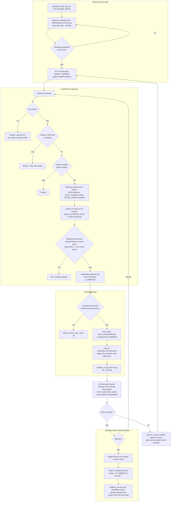

# From source to Arcade RBF

How a core's bitstream is produced, deployed and released, as the skill's scripts do it.
Every refusal box is a check that exists because its absence once cost a session; the
scripts' own headers say which.

The prefix rule: the `.mra` names the core without `Arcade-`, the file on the device follows it
(`Name_NNNNNNNN.rbf`), and only the released bitstream keeps the prefix, which the README's
install step tells the user to drop.
